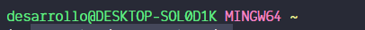

# Primer **hola mundo**
### Creacion de archivo
Se crea un archivo llamado **hola_mundo** con la extension *.py*
### Ejecucion del programa
Para ejecutar el programa hay que:

* Posicionarse en la carpeta contenedora del archivo a ejecutar
  *En mi caso el proyecto esta en **Desktop** dentro de la carpeta **curso_python** en la carpeta **hola_mundo***

  

  ```bash
  cd Desktop/curso_python/
  ```

  

  ```bash
  cd hola_mundo/
  ```

  
* Escribes el comando

  ```bash
  ptyhon hola_mundo.py
  ```

  Y debera de aparecer el mensaje que indicaste que se hiciera el print
  


