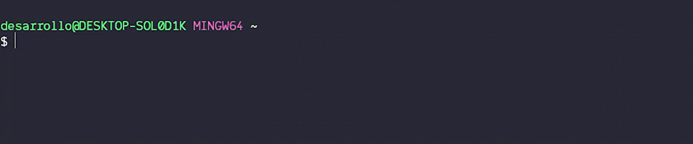
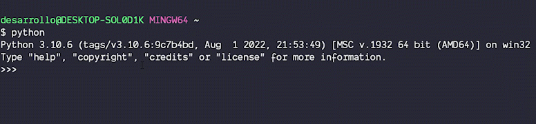
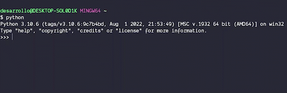

# REPL

## Que es el REPL?

Se trata del shell (consola) que ofrece python para hacer operacion basicas, REPL es un acronimo **R**ead **E**val **P**rint **L**oop, y de esa forma trabaja:

* Espera un input de datos y de instrucciones **R**ead
* Evalua las intrucciones y los datos capturados **E**val
* Despues de evaluar imprime el resultado **P**rint
* Regresa al estado inicial de espera del input **L**oop

## Como accedo?

En la terminal debes de escribir

```bash
python
```

y dar enter para que te muestre el prompt **>>**



## Que puedo hacer ahi?

Operaciones de cualquier tipo, tanto matematicas como manejo de strings, la shell nos ayuda a ir familiarizandonos con el lenguaje y para ejecutar comandos de una sola linea

## Ejemplos


### Suma de dos numeros

Escribimos la operacion

```python
3 + 8
```

Y al dar enter nos mostrara el resultado



### Asignacion de valores a variables

Tecleamos la asignacion y damos enter, luego tecleamos el nombre de la variable que creamos y damos enter enter de nuevo para que nos muestre el valor que asignamos anteriormente

```python
cantidadDeGalletas = 20
cantidadDeGalletas
```


