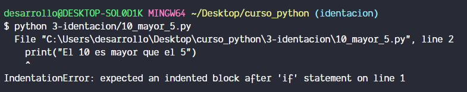
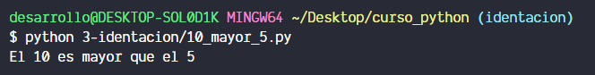

# Que es la indentacion?

Como tal la indentacion se utiliza para que nuestro codigo sea visualmente mas facil de entender ya que al momento de estar las lineas de codigo desplazadas ligeramente a la derecha podemos comprender que estamos dentro de un ciclo, un condicional o una funcion.

# Y eso que tiene que ver con Python?

En python la indentacion toma un sigificado aun mas importante ya que es regla que el codigo este indentado para que se pueda ejecutar, por lo que si estamos tecleando un condicional y la primera parte a ejecutar no esta indentada estas instrucciones nos generaran un error o simplemente no se podra ejecutar

# Ejemplo

Para visualizar como funciona la indentacion crearemos un archivo llamado **10_mayor_5.py** y teclearemos el siguiente codigo:

```python
if 10 > 5:
print("El 10 es mayor al 5")
```

Lo que hace el codigo anterior es validar si 10 es mayor que 5, si se cumple la condicion se imprimira el mensaje **El 10 es mayor al 5**

Al momento de ejecutarlo obtenemos el siguiente resultado



Ahi se nos muestra el error sobre la indentacion que deberia de existir

Si corregimos el codigo y lo dejamos de la siguiente manera denotando con la indentacion que la sentencia print es parte interna del condicional:

```python
if 10 > 5:
    print("El 10 es mayor al 5")
```

La ejecucion nos dara el siguiente resultado:


