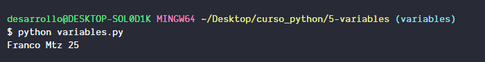
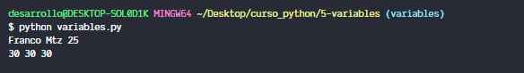

# Que es una variable en Python?

Como en cualquier lenguaje de programacion, las variables son elementos que usamos para guardar informacion para usarla en algun momento despues de declararlas, podemos decir que son como cajitas donde metemos valores para despues usar esor valores para lo que ocupemos.

El Python no se requiere declarar el tipo de dato de los datos que guardaremos en las variable, por lo que podemos guardar en una variable un numero y mas adelante guardar una cadena y no habra problema.

```python
nombre = 'Franco Mtz'
edad = 25
```

Asi de simple se declaran variables podemos hacer una impreison de sus valores con

```python
print(nombre, edad)
```

y el resultado sera



Tambien es posible asignar en una sola linea de codigo el mismo valor a mas de una variable

```python
dato = edad = anios = 30
```


