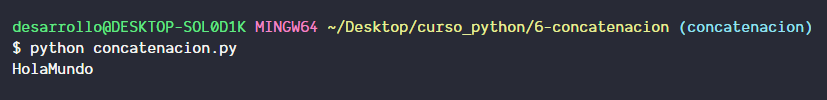
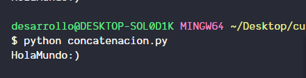

# Que es la concatenacion?

Concatenar es unir dos cadenas de texto aunque la union se haga a traves de dos o mas variables,  o de variables con literales de texto, en python se haria de la siguiente manera:

```python
var1 = "Hola"
var2 = "Mundo"
var3 = var1 + var2
print(var3)
```

El resultado de lo anterior seria



Tambien podriamos hacer lo siguiente

```python
var3 = va1+var2+" :)"
```

El resultado seria


