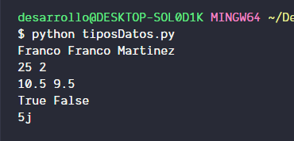

# Que son los tipos de datos?

En programacion los tipos de datos hacen referencia a la naturaleza de los valores con los que puede trabajar el lenguaje, por ejemplo los tipos de datos basico podriamos decir que son:

* **Strings** (*Cadenas*): son datos que representan palabras u oraciones
* **Int** (*Enteros*): son numeros sin punto decimal.

Estos son tipos de datos cuyo uso es basico, tambien existen:

* **Float** (*Flotantes*): son los numeros con punto decimal
* **Boolean** (*Boleanos*): represtan valores Verdadero o Falso
* **Complex** (*Complejos*): Numeros que contienen una parte real y una parte imaginaria

# Ejemplos

```python
#Strings
nombre = "Franco"
nombreCompleto = "Franco Martinez"
print(nombre, nombreCompleto)

#Int
edad = 25
hermanos = 2
print(edad,hermanos)

#Float
precio = 10.50
promedio = (10+9)/2
print(precio,promedio)

#Boolean
aprendoPython = True
iLikeHotDogs = False
print(aprendoPython, iLikeHotDogs)

#Complex
#Los numeros complejos en python se denotan con la letra j despues del literal
complejo = 5j
print(complejo)

```

Si el codigo anterior lo ejecutamos la salida seria la siguiente


