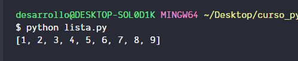
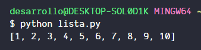
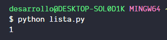

# Que son las listas?

Las listas son colecciones de datos, en otros lenguajes se les conoce como arreglos, esta estructura nos permite almacenar multiples valores, que sean del mismo tipo de dato o no.

La forma de instanciarlas es la siguiente

```python
lista = [1,2,3,4,5,6,7,8,9]
print(lista)
```

Si hacemos una impresion de la variable obtenemos el siguiente resultado



El lenguaje al poseer la capacidad de manejar listas, ofrece metodos para poder manipular estos elementos, para poder agregar, eliminar, ver o listar los elementos, por ejemplo si se quiere agregar un elemento a la lista anterior se usaria el metodo append que ingresa el elemento que le indiquemos al final de la lista que le indiquemos

```python
lista.append(10)
```

Si imprimimos la lista el resultado seria



como se ve, agrega el elemento que indicamos al final de la lista

O por ejemplo para mostrar un elemento en especifico hariamos lo siguiente

```python
print(lista[0])
```

Si mostramos la lista el resultaro seria



Mostrando solo el elemento de la lista que esta en el indice 0
